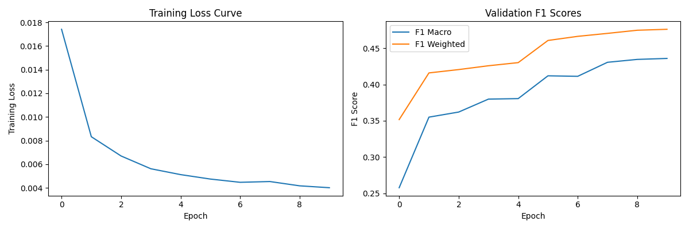

# Demo of Code-Switching Language Identification Mask Out

This is the demo and also proof of the concept

## File Structure

```
project_root/
├── CS_Dataset.py
├── train.py
├── loss.py
├── utils/
│   └── build_datasets.py
├── lid_hineng
│   ├── dev.conll
│   ├── test.conll
│   └── train.conll
├── lid_spaeng
│   ├── dev.conll
│   ├── test.conll
│   └── train.conll
├── lid_nepeng
│   ├── dev.conll
│   ├── test.conll
│   └── train.conll
├── logs
├── outputs
└── plot
```

`analysis.py` is for analyzing the information about the dataset, like number of classes and label distribution.

We are using [LinCE datasets](https://ritual.uh.edu/lince/datasets), which are `lid_hineng` and  `lid_spaeng` with train, dev and test datasets in .conll format.

## Train the model

```bash
python train.py
```

Train the model on the English-Spanish with masking out and test on the English-Hindi.

## Results


- Mask Out Prob = 0

```txt
2024-11-16 14:05:43,374 [INFO] Evaluating on test set...
2024-11-16 14:05:44,601 [INFO] Test Results: F1 Macro = 0.8221, F1 Weighted = 0.8149
```

- Mask Out Prob = 0.15

```txt
2024-11-16 13:02:22,601 [INFO] Evaluating on test set...
2024-11-16 13:02:23,879 [INFO] Test Results: F1 Macro = 0.8263, F1 Weighted = 0.8203
```

## Issue

### 1. Only calculated the weights depend on the training data.


## Forward step

### 1. Implement the code for other metrics.

### 2. Implement the code on the test dataset after different models with different mask prob are trained and saved. Show the final results.

### 3. Any potential optimization.


