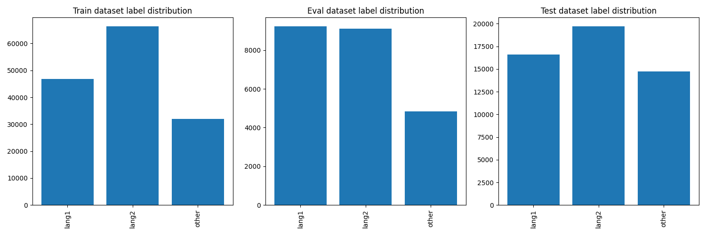

# Demo of Code-Switching Language Identification Mask Out

This is the demo and also proof of the concept

## File Structure

```
project_root/
├── CS_Dataset.py
├── train.py
├── loss.py
├── utils/
│   └── build_datasets.py
├── lid_hineng
│   ├── dev.conll
│   ├── test.conll
│   └── train.conll
├── lid_spaeng
│   ├── dev.conll
│   ├── test.conll
│   └── train.conll
├── logs
├── outputs
└── plot
```

`analysis.py` is for analyzing the information about the dataset, like number of classes and label distribution.

We are using [LinCE datasets](https://ritual.uh.edu/lince/datasets), which are `lid_hineng` and  `lid_spaeng` with train, dev and test datasets in .conll format.

## Train the model

```bash
python train.py
```

Train the model on the English-Spanish with masking out and test on the English-Hindi.

## Results


```txt
2024-11-04 00:47:44,921 [INFO] Starting training...
2024-11-04 00:48:51,282 [INFO] Epoch 1/5: Train Loss = 0.0142, Dev F1 Macro = 0.3167, Dev F1 Weighted = 0.3925
2024-11-04 00:48:51,662 [INFO] Saved new best model with F1 Macro: 0.3167
2024-11-04 00:49:56,901 [INFO] Epoch 2/5: Train Loss = 0.0070, Dev F1 Macro = 0.3518, Dev F1 Weighted = 0.4265
2024-11-04 00:49:57,238 [INFO] Saved new best model with F1 Macro: 0.3518
2024-11-04 00:51:02,505 [INFO] Epoch 3/5: Train Loss = 0.0058, Dev F1 Macro = 0.3738, Dev F1 Weighted = 0.4345
2024-11-04 00:51:02,962 [INFO] Saved new best model with F1 Macro: 0.3738
2024-11-04 00:52:08,341 [INFO] Epoch 4/5: Train Loss = 0.0049, Dev F1 Macro = 0.3868, Dev F1 Weighted = 0.4406
2024-11-04 00:52:08,753 [INFO] Saved new best model with F1 Macro: 0.3868
2024-11-04 00:53:14,003 [INFO] Epoch 5/5: Train Loss = 0.0045, Dev F1 Macro = 0.3949, Dev F1 Weighted = 0.4509
2024-11-04 00:53:14,372 [INFO] Saved new best model with F1 Macro: 0.3949
2024-11-04 00:53:14,372 [INFO] Evaluating on test set...
2024-11-04 00:53:15,110 [INFO] Test Results: F1 Macro = 0.2917, F1 Weighted = 0.4052
```

## Issue

### 1. The distribution of labels is not balance.


### 2. F1 score is so low!!!


