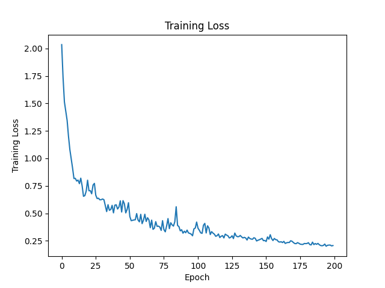
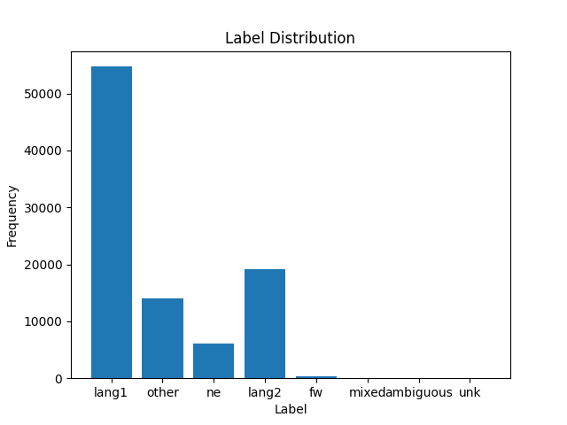

# Demo of Code-Switching Language Identification Mask Out

This is the demo and also proof of the concept

## File Structure

```
project_root/
├── CS_Dataset.py
├── train.py
├── utils/
│	├──analysis.py
│   └──build_datasets.py
├── lid_hineng/
│	├──dev.conll
│	├──test.conll
│   └──train.conll
├── lid_spaeng/
│	├──dev.conll
│	├──test.conll
│   └──train.conll
├── en-es/
│	├──dev
│	├──train
│   └──mask_vec
├── en-hi/
│	├──dev
│	├──train
│   └──mask_vec
├── cc.en.300.bin
├── cc.es.300.bin
├── cc.hi.300.bin
```

`analysis.py` is for analyzing the information about the dataset, like number of classes and label distribution.

`cc.en.300.bin`, `cc.es.300.bin`  and `cc.hi.300.bin` are English, Spanish and Hindi word embedding vectors from [word vec](https://fasttext.cc/docs/en/crawl-vectors.html). It will be bit slow if we search the vector during thr training process. So we can by running the `build_datasets.py` to build the datasets in advance. We are using [LinCE datasets](https://ritual.uh.edu/lince/datasets), which are `lid_hineng` and  `lid_spaeng` with train, dev and test datasets in .conll format.

```bash
python build_datasets.py
```

After running, there will be folders called `en-es` and `en-hi` containing datasets with 20 tokens of each sentence and 300 dimension word vec of each token.

## Train the model

```bash
python train.py
```

Train the model on the English-Spanish with masking out and test on the English-Hindi.

## Results


```txt
Test F1 Macro: 0.0749, Test F1 Weighted: 0.2169
```

**We may assume there is probabilty the mask out works, because the metrics on the test data even better than the dev data.**

```txt
Epoch 1/200, Train Loss: 2.0347, Dev F1 Macro: 0.1295, Dev F1 Weighted: 0.3654
Epoch 2/200, Train Loss: 1.7362, Dev F1 Macro: 0.0686, Dev F1 Weighted: 0.1123
Epoch 3/200, Train Loss: 1.5134, Dev F1 Macro: 0.0659, Dev F1 Weighted: 0.0938
Epoch 4/200, Train Loss: 1.4272, Dev F1 Macro: 0.0544, Dev F1 Weighted: 0.0814
Epoch 5/200, Train Loss: 1.3446, Dev F1 Macro: 0.0571, Dev F1 Weighted: 0.0800
Epoch 6/200, Train Loss: 1.1997, Dev F1 Macro: 0.0686, Dev F1 Weighted: 0.0952
Epoch 7/200, Train Loss: 1.0794, Dev F1 Macro: 0.0676, Dev F1 Weighted: 0.1024
Epoch 8/200, Train Loss: 0.9953, Dev F1 Macro: 0.0659, Dev F1 Weighted: 0.0905
Epoch 9/200, Train Loss: 0.9107, Dev F1 Macro: 0.0689, Dev F1 Weighted: 0.0962
Epoch 10/200, Train Loss: 0.8168, Dev F1 Macro: 0.0722, Dev F1 Weighted: 0.1010
Epoch 11/200, Train Loss: 0.8183, Dev F1 Macro: 0.0447, Dev F1 Weighted: 0.0738
Epoch 12/200, Train Loss: 0.7938, Dev F1 Macro: 0.0495, Dev F1 Weighted: 0.0770
Epoch 13/200, Train Loss: 0.8027, Dev F1 Macro: 0.0736, Dev F1 Weighted: 0.0966
Epoch 14/200, Train Loss: 0.7703, Dev F1 Macro: 0.0232, Dev F1 Weighted: 0.0209
Epoch 15/200, Train Loss: 0.8201, Dev F1 Macro: 0.0503, Dev F1 Weighted: 0.0847
Epoch 16/200, Train Loss: 0.7503, Dev F1 Macro: 0.0415, Dev F1 Weighted: 0.0652
Epoch 17/200, Train Loss: 0.6552, Dev F1 Macro: 0.0807, Dev F1 Weighted: 0.1117
Epoch 18/200, Train Loss: 0.6613, Dev F1 Macro: 0.0345, Dev F1 Weighted: 0.0358
Epoch 19/200, Train Loss: 0.7035, Dev F1 Macro: 0.0073, Dev F1 Weighted: 0.0075
Epoch 20/200, Train Loss: 0.8015, Dev F1 Macro: 0.0696, Dev F1 Weighted: 0.0961
Epoch 21/200, Train Loss: 0.7056, Dev F1 Macro: 0.1365, Dev F1 Weighted: 0.2108
Epoch 22/200, Train Loss: 0.7069, Dev F1 Macro: 0.0979, Dev F1 Weighted: 0.1349
Epoch 23/200, Train Loss: 0.6780, Dev F1 Macro: 0.1041, Dev F1 Weighted: 0.1523
Epoch 24/200, Train Loss: 0.7573, Dev F1 Macro: 0.0807, Dev F1 Weighted: 0.1181
Epoch 25/200, Train Loss: 0.7726, Dev F1 Macro: 0.0715, Dev F1 Weighted: 0.0945
Epoch 26/200, Train Loss: 0.6653, Dev F1 Macro: 0.0764, Dev F1 Weighted: 0.1009
Epoch 27/200, Train Loss: 0.6346, Dev F1 Macro: 0.0830, Dev F1 Weighted: 0.1204
Epoch 28/200, Train Loss: 0.6376, Dev F1 Macro: 0.0580, Dev F1 Weighted: 0.0704
Epoch 29/200, Train Loss: 0.6233, Dev F1 Macro: 0.0972, Dev F1 Weighted: 0.1361
Epoch 30/200, Train Loss: 0.6244, Dev F1 Macro: 0.1042, Dev F1 Weighted: 0.1661
Epoch 31/200, Train Loss: 0.6307, Dev F1 Macro: 0.0688, Dev F1 Weighted: 0.0946
Epoch 32/200, Train Loss: 0.6239, Dev F1 Macro: 0.0855, Dev F1 Weighted: 0.1178
Epoch 33/200, Train Loss: 0.5704, Dev F1 Macro: 0.0706, Dev F1 Weighted: 0.1000
Epoch 34/200, Train Loss: 0.5160, Dev F1 Macro: 0.0786, Dev F1 Weighted: 0.1053
Epoch 35/200, Train Loss: 0.5787, Dev F1 Macro: 0.0906, Dev F1 Weighted: 0.1249
Epoch 36/200, Train Loss: 0.5278, Dev F1 Macro: 0.0592, Dev F1 Weighted: 0.0941
Epoch 37/200, Train Loss: 0.5352, Dev F1 Macro: 0.0934, Dev F1 Weighted: 0.1329
Epoch 38/200, Train Loss: 0.5729, Dev F1 Macro: 0.0826, Dev F1 Weighted: 0.1122
Epoch 39/200, Train Loss: 0.5045, Dev F1 Macro: 0.0710, Dev F1 Weighted: 0.1057
Epoch 40/200, Train Loss: 0.5746, Dev F1 Macro: 0.1172, Dev F1 Weighted: 0.2453
Epoch 41/200, Train Loss: 0.5782, Dev F1 Macro: 0.0609, Dev F1 Weighted: 0.1160
Epoch 42/200, Train Loss: 0.5393, Dev F1 Macro: 0.1079, Dev F1 Weighted: 0.2354
Epoch 43/200, Train Loss: 0.5573, Dev F1 Macro: 0.0283, Dev F1 Weighted: 0.0405
Epoch 44/200, Train Loss: 0.6138, Dev F1 Macro: 0.0142, Dev F1 Weighted: 0.0207
Epoch 45/200, Train Loss: 0.5122, Dev F1 Macro: 0.1153, Dev F1 Weighted: 0.2663
Epoch 46/200, Train Loss: 0.6157, Dev F1 Macro: 0.1469, Dev F1 Weighted: 0.3043
Epoch 47/200, Train Loss: 0.5872, Dev F1 Macro: 0.1166, Dev F1 Weighted: 0.2259
Epoch 48/200, Train Loss: 0.5042, Dev F1 Macro: 0.1154, Dev F1 Weighted: 0.2007
Epoch 49/200, Train Loss: 0.5362, Dev F1 Macro: 0.1238, Dev F1 Weighted: 0.2077
Epoch 50/200, Train Loss: 0.5966, Dev F1 Macro: 0.1293, Dev F1 Weighted: 0.2275
Epoch 51/200, Train Loss: 0.4714, Dev F1 Macro: 0.1110, Dev F1 Weighted: 0.1966
Epoch 52/200, Train Loss: 0.4333, Dev F1 Macro: 0.1322, Dev F1 Weighted: 0.2510
Epoch 53/200, Train Loss: 0.4366, Dev F1 Macro: 0.1466, Dev F1 Weighted: 0.2592
Epoch 54/200, Train Loss: 0.4401, Dev F1 Macro: 0.0724, Dev F1 Weighted: 0.1141
Epoch 55/200, Train Loss: 0.4415, Dev F1 Macro: 0.1567, Dev F1 Weighted: 0.3186
Epoch 56/200, Train Loss: 0.4980, Dev F1 Macro: 0.1130, Dev F1 Weighted: 0.2506
Epoch 57/200, Train Loss: 0.4400, Dev F1 Macro: 0.1833, Dev F1 Weighted: 0.3831
Epoch 58/200, Train Loss: 0.4230, Dev F1 Macro: 0.1126, Dev F1 Weighted: 0.1818
Epoch 59/200, Train Loss: 0.4911, Dev F1 Macro: 0.1068, Dev F1 Weighted: 0.1950
Epoch 60/200, Train Loss: 0.4063, Dev F1 Macro: 0.1652, Dev F1 Weighted: 0.3883
Epoch 61/200, Train Loss: 0.4385, Dev F1 Macro: 0.1339, Dev F1 Weighted: 0.2587
Epoch 62/200, Train Loss: 0.4922, Dev F1 Macro: 0.1146, Dev F1 Weighted: 0.2827
Epoch 63/200, Train Loss: 0.4263, Dev F1 Macro: 0.1427, Dev F1 Weighted: 0.3386
Epoch 64/200, Train Loss: 0.4600, Dev F1 Macro: 0.1141, Dev F1 Weighted: 0.2098
Epoch 65/200, Train Loss: 0.4405, Dev F1 Macro: 0.1304, Dev F1 Weighted: 0.2740
Epoch 66/200, Train Loss: 0.3694, Dev F1 Macro: 0.1418, Dev F1 Weighted: 0.3341
Epoch 67/200, Train Loss: 0.4384, Dev F1 Macro: 0.1661, Dev F1 Weighted: 0.4218
Epoch 68/200, Train Loss: 0.3545, Dev F1 Macro: 0.1209, Dev F1 Weighted: 0.2003
Epoch 69/200, Train Loss: 0.3652, Dev F1 Macro: 0.1126, Dev F1 Weighted: 0.1710
Epoch 70/200, Train Loss: 0.4246, Dev F1 Macro: 0.1260, Dev F1 Weighted: 0.2028
Epoch 71/200, Train Loss: 0.3817, Dev F1 Macro: 0.0940, Dev F1 Weighted: 0.1509
Epoch 72/200, Train Loss: 0.3841, Dev F1 Macro: 0.1293, Dev F1 Weighted: 0.2112
Epoch 73/200, Train Loss: 0.3750, Dev F1 Macro: 0.0802, Dev F1 Weighted: 0.1220
Epoch 74/200, Train Loss: 0.3449, Dev F1 Macro: 0.1199, Dev F1 Weighted: 0.1930
Epoch 75/200, Train Loss: 0.4333, Dev F1 Macro: 0.0612, Dev F1 Weighted: 0.1154
Epoch 76/200, Train Loss: 0.3522, Dev F1 Macro: 0.0661, Dev F1 Weighted: 0.1120
Epoch 77/200, Train Loss: 0.3319, Dev F1 Macro: 0.0764, Dev F1 Weighted: 0.1391
Epoch 78/200, Train Loss: 0.3867, Dev F1 Macro: 0.0826, Dev F1 Weighted: 0.1421
Epoch 79/200, Train Loss: 0.4524, Dev F1 Macro: 0.1060, Dev F1 Weighted: 0.2656
Epoch 80/200, Train Loss: 0.3609, Dev F1 Macro: 0.1035, Dev F1 Weighted: 0.2407
Epoch 81/200, Train Loss: 0.4148, Dev F1 Macro: 0.1457, Dev F1 Weighted: 0.3339
Epoch 82/200, Train Loss: 0.3952, Dev F1 Macro: 0.1087, Dev F1 Weighted: 0.2000
Epoch 83/200, Train Loss: 0.3843, Dev F1 Macro: 0.1235, Dev F1 Weighted: 0.2478
Epoch 84/200, Train Loss: 0.4240, Dev F1 Macro: 0.1669, Dev F1 Weighted: 0.3669
Epoch 85/200, Train Loss: 0.5600, Dev F1 Macro: 0.1161, Dev F1 Weighted: 0.2281
Epoch 86/200, Train Loss: 0.3901, Dev F1 Macro: 0.1501, Dev F1 Weighted: 0.3203
Epoch 87/200, Train Loss: 0.3799, Dev F1 Macro: 0.1594, Dev F1 Weighted: 0.3518
Epoch 88/200, Train Loss: 0.3410, Dev F1 Macro: 0.1627, Dev F1 Weighted: 0.3455
Epoch 89/200, Train Loss: 0.3509, Dev F1 Macro: 0.1804, Dev F1 Weighted: 0.3871
Epoch 90/200, Train Loss: 0.3197, Dev F1 Macro: 0.1521, Dev F1 Weighted: 0.3034
Epoch 91/200, Train Loss: 0.3378, Dev F1 Macro: 0.1330, Dev F1 Weighted: 0.2639
Epoch 92/200, Train Loss: 0.3238, Dev F1 Macro: 0.1440, Dev F1 Weighted: 0.3118
Epoch 93/200, Train Loss: 0.3476, Dev F1 Macro: 0.1487, Dev F1 Weighted: 0.3295
Epoch 94/200, Train Loss: 0.3217, Dev F1 Macro: 0.1496, Dev F1 Weighted: 0.3398
Epoch 95/200, Train Loss: 0.3177, Dev F1 Macro: 0.1366, Dev F1 Weighted: 0.2917
Epoch 96/200, Train Loss: 0.3110, Dev F1 Macro: 0.1549, Dev F1 Weighted: 0.3203
Epoch 97/200, Train Loss: 0.2962, Dev F1 Macro: 0.1391, Dev F1 Weighted: 0.2807
Epoch 98/200, Train Loss: 0.3587, Dev F1 Macro: 0.0910, Dev F1 Weighted: 0.1551
Epoch 99/200, Train Loss: 0.3662, Dev F1 Macro: 0.1605, Dev F1 Weighted: 0.3142
Epoch 100/200, Train Loss: 0.4208, Dev F1 Macro: 0.0994, Dev F1 Weighted: 0.1760
Epoch 101/200, Train Loss: 0.3651, Dev F1 Macro: 0.1402, Dev F1 Weighted: 0.2615
Epoch 102/200, Train Loss: 0.3458, Dev F1 Macro: 0.1542, Dev F1 Weighted: 0.3051
Epoch 103/200, Train Loss: 0.3224, Dev F1 Macro: 0.1511, Dev F1 Weighted: 0.2991
Epoch 104/200, Train Loss: 0.3180, Dev F1 Macro: 0.1547, Dev F1 Weighted: 0.3170
Epoch 105/200, Train Loss: 0.3918, Dev F1 Macro: 0.0793, Dev F1 Weighted: 0.1350
Epoch 106/200, Train Loss: 0.4088, Dev F1 Macro: 0.0948, Dev F1 Weighted: 0.2100
Epoch 107/200, Train Loss: 0.3216, Dev F1 Macro: 0.1126, Dev F1 Weighted: 0.2415
Epoch 108/200, Train Loss: 0.3870, Dev F1 Macro: 0.0889, Dev F1 Weighted: 0.1971
Epoch 109/200, Train Loss: 0.3667, Dev F1 Macro: 0.0857, Dev F1 Weighted: 0.1737
Epoch 110/200, Train Loss: 0.3074, Dev F1 Macro: 0.0800, Dev F1 Weighted: 0.1380
Epoch 111/200, Train Loss: 0.3336, Dev F1 Macro: 0.0867, Dev F1 Weighted: 0.1708
Epoch 112/200, Train Loss: 0.3201, Dev F1 Macro: 0.0930, Dev F1 Weighted: 0.1729
Epoch 113/200, Train Loss: 0.3108, Dev F1 Macro: 0.0939, Dev F1 Weighted: 0.1739
Epoch 114/200, Train Loss: 0.2914, Dev F1 Macro: 0.0949, Dev F1 Weighted: 0.1733
Epoch 115/200, Train Loss: 0.2968, Dev F1 Macro: 0.1041, Dev F1 Weighted: 0.1892
Epoch 116/200, Train Loss: 0.3120, Dev F1 Macro: 0.0994, Dev F1 Weighted: 0.1870
Epoch 117/200, Train Loss: 0.2802, Dev F1 Macro: 0.1041, Dev F1 Weighted: 0.1878
Epoch 118/200, Train Loss: 0.2915, Dev F1 Macro: 0.1129, Dev F1 Weighted: 0.2245
Epoch 119/200, Train Loss: 0.2976, Dev F1 Macro: 0.0995, Dev F1 Weighted: 0.1741
Epoch 120/200, Train Loss: 0.2764, Dev F1 Macro: 0.1115, Dev F1 Weighted: 0.1964
Epoch 121/200, Train Loss: 0.3110, Dev F1 Macro: 0.1032, Dev F1 Weighted: 0.1800
Epoch 122/200, Train Loss: 0.3021, Dev F1 Macro: 0.1030, Dev F1 Weighted: 0.1856
Epoch 123/200, Train Loss: 0.2956, Dev F1 Macro: 0.0944, Dev F1 Weighted: 0.1585
Epoch 124/200, Train Loss: 0.2758, Dev F1 Macro: 0.0999, Dev F1 Weighted: 0.1699
Epoch 125/200, Train Loss: 0.2820, Dev F1 Macro: 0.1164, Dev F1 Weighted: 0.2126
Epoch 126/200, Train Loss: 0.2960, Dev F1 Macro: 0.1068, Dev F1 Weighted: 0.1839
Epoch 127/200, Train Loss: 0.2704, Dev F1 Macro: 0.1295, Dev F1 Weighted: 0.2401
Epoch 128/200, Train Loss: 0.3207, Dev F1 Macro: 0.1213, Dev F1 Weighted: 0.2458
Epoch 129/200, Train Loss: 0.2949, Dev F1 Macro: 0.1303, Dev F1 Weighted: 0.2438
Epoch 130/200, Train Loss: 0.2876, Dev F1 Macro: 0.1166, Dev F1 Weighted: 0.2007
Epoch 131/200, Train Loss: 0.2885, Dev F1 Macro: 0.1289, Dev F1 Weighted: 0.2490
Epoch 132/200, Train Loss: 0.2989, Dev F1 Macro: 0.1028, Dev F1 Weighted: 0.1595
Epoch 133/200, Train Loss: 0.2859, Dev F1 Macro: 0.1024, Dev F1 Weighted: 0.1779
Epoch 134/200, Train Loss: 0.2763, Dev F1 Macro: 0.0885, Dev F1 Weighted: 0.1358
Epoch 135/200, Train Loss: 0.2819, Dev F1 Macro: 0.1037, Dev F1 Weighted: 0.1856
Epoch 136/200, Train Loss: 0.2756, Dev F1 Macro: 0.0925, Dev F1 Weighted: 0.1532
Epoch 137/200, Train Loss: 0.2575, Dev F1 Macro: 0.0873, Dev F1 Weighted: 0.1330
Epoch 138/200, Train Loss: 0.2841, Dev F1 Macro: 0.0763, Dev F1 Weighted: 0.1178
Epoch 139/200, Train Loss: 0.2715, Dev F1 Macro: 0.0786, Dev F1 Weighted: 0.1334
Epoch 140/200, Train Loss: 0.2661, Dev F1 Macro: 0.0822, Dev F1 Weighted: 0.1481
Epoch 141/200, Train Loss: 0.2645, Dev F1 Macro: 0.0849, Dev F1 Weighted: 0.1540
Epoch 142/200, Train Loss: 0.2783, Dev F1 Macro: 0.0719, Dev F1 Weighted: 0.1088
Epoch 143/200, Train Loss: 0.2727, Dev F1 Macro: 0.0945, Dev F1 Weighted: 0.1789
Epoch 144/200, Train Loss: 0.2486, Dev F1 Macro: 0.0830, Dev F1 Weighted: 0.1403
Epoch 145/200, Train Loss: 0.2555, Dev F1 Macro: 0.0973, Dev F1 Weighted: 0.1814
Epoch 146/200, Train Loss: 0.2599, Dev F1 Macro: 0.0891, Dev F1 Weighted: 0.1776
Epoch 147/200, Train Loss: 0.2663, Dev F1 Macro: 0.0883, Dev F1 Weighted: 0.1600
Epoch 148/200, Train Loss: 0.2722, Dev F1 Macro: 0.0897, Dev F1 Weighted: 0.1676
Epoch 149/200, Train Loss: 0.2518, Dev F1 Macro: 0.0838, Dev F1 Weighted: 0.1392
Epoch 150/200, Train Loss: 0.2533, Dev F1 Macro: 0.0870, Dev F1 Weighted: 0.1498
Epoch 151/200, Train Loss: 0.2439, Dev F1 Macro: 0.0832, Dev F1 Weighted: 0.1438
Epoch 152/200, Train Loss: 0.2854, Dev F1 Macro: 0.0913, Dev F1 Weighted: 0.1640
Epoch 153/200, Train Loss: 0.2651, Dev F1 Macro: 0.1027, Dev F1 Weighted: 0.2273
Epoch 154/200, Train Loss: 0.3058, Dev F1 Macro: 0.1175, Dev F1 Weighted: 0.2310
Epoch 155/200, Train Loss: 0.2698, Dev F1 Macro: 0.1066, Dev F1 Weighted: 0.2077
Epoch 156/200, Train Loss: 0.2527, Dev F1 Macro: 0.0986, Dev F1 Weighted: 0.1868
Epoch 157/200, Train Loss: 0.2716, Dev F1 Macro: 0.0849, Dev F1 Weighted: 0.1405
Epoch 158/200, Train Loss: 0.2605, Dev F1 Macro: 0.0809, Dev F1 Weighted: 0.1271
Epoch 159/200, Train Loss: 0.2588, Dev F1 Macro: 0.0817, Dev F1 Weighted: 0.1336
Epoch 160/200, Train Loss: 0.2421, Dev F1 Macro: 0.0854, Dev F1 Weighted: 0.1450
Epoch 161/200, Train Loss: 0.2385, Dev F1 Macro: 0.0829, Dev F1 Weighted: 0.1432
Epoch 162/200, Train Loss: 0.2418, Dev F1 Macro: 0.0808, Dev F1 Weighted: 0.1369
Epoch 163/200, Train Loss: 0.2342, Dev F1 Macro: 0.0899, Dev F1 Weighted: 0.1557
Epoch 164/200, Train Loss: 0.2450, Dev F1 Macro: 0.0898, Dev F1 Weighted: 0.1568
Epoch 165/200, Train Loss: 0.2261, Dev F1 Macro: 0.0865, Dev F1 Weighted: 0.1441
Epoch 166/200, Train Loss: 0.2324, Dev F1 Macro: 0.0945, Dev F1 Weighted: 0.1751
Epoch 167/200, Train Loss: 0.2353, Dev F1 Macro: 0.1077, Dev F1 Weighted: 0.2009
Epoch 168/200, Train Loss: 0.2349, Dev F1 Macro: 0.1116, Dev F1 Weighted: 0.2153
Epoch 169/200, Train Loss: 0.2509, Dev F1 Macro: 0.0979, Dev F1 Weighted: 0.1770
Epoch 170/200, Train Loss: 0.2461, Dev F1 Macro: 0.0914, Dev F1 Weighted: 0.1469
Epoch 171/200, Train Loss: 0.2344, Dev F1 Macro: 0.0819, Dev F1 Weighted: 0.1279
Epoch 172/200, Train Loss: 0.2255, Dev F1 Macro: 0.0851, Dev F1 Weighted: 0.1313
Epoch 173/200, Train Loss: 0.2242, Dev F1 Macro: 0.0857, Dev F1 Weighted: 0.1373
Epoch 174/200, Train Loss: 0.2337, Dev F1 Macro: 0.0853, Dev F1 Weighted: 0.1368
Epoch 175/200, Train Loss: 0.2278, Dev F1 Macro: 0.0809, Dev F1 Weighted: 0.1263
Epoch 176/200, Train Loss: 0.2198, Dev F1 Macro: 0.0833, Dev F1 Weighted: 0.1323
Epoch 177/200, Train Loss: 0.2178, Dev F1 Macro: 0.0837, Dev F1 Weighted: 0.1338
Epoch 178/200, Train Loss: 0.2174, Dev F1 Macro: 0.0832, Dev F1 Weighted: 0.1309
Epoch 179/200, Train Loss: 0.2258, Dev F1 Macro: 0.0846, Dev F1 Weighted: 0.1416
Epoch 180/200, Train Loss: 0.2247, Dev F1 Macro: 0.0894, Dev F1 Weighted: 0.1535
Epoch 181/200, Train Loss: 0.2259, Dev F1 Macro: 0.0860, Dev F1 Weighted: 0.1481
Epoch 182/200, Train Loss: 0.2330, Dev F1 Macro: 0.0907, Dev F1 Weighted: 0.1578
Epoch 183/200, Train Loss: 0.2160, Dev F1 Macro: 0.0889, Dev F1 Weighted: 0.1532
Epoch 184/200, Train Loss: 0.2126, Dev F1 Macro: 0.0932, Dev F1 Weighted: 0.1680
Epoch 185/200, Train Loss: 0.2382, Dev F1 Macro: 0.0941, Dev F1 Weighted: 0.1688
Epoch 186/200, Train Loss: 0.2158, Dev F1 Macro: 0.0948, Dev F1 Weighted: 0.1718
Epoch 187/200, Train Loss: 0.2255, Dev F1 Macro: 0.0962, Dev F1 Weighted: 0.1794
Epoch 188/200, Train Loss: 0.2183, Dev F1 Macro: 0.0910, Dev F1 Weighted: 0.1573
Epoch 189/200, Train Loss: 0.2267, Dev F1 Macro: 0.0930, Dev F1 Weighted: 0.1670
Epoch 190/200, Train Loss: 0.2146, Dev F1 Macro: 0.0888, Dev F1 Weighted: 0.1494
Epoch 191/200, Train Loss: 0.2072, Dev F1 Macro: 0.0875, Dev F1 Weighted: 0.1463
Epoch 192/200, Train Loss: 0.2052, Dev F1 Macro: 0.0883, Dev F1 Weighted: 0.1476
Epoch 193/200, Train Loss: 0.2084, Dev F1 Macro: 0.0865, Dev F1 Weighted: 0.1398
Epoch 194/200, Train Loss: 0.2207, Dev F1 Macro: 0.0878, Dev F1 Weighted: 0.1449
Epoch 195/200, Train Loss: 0.2008, Dev F1 Macro: 0.0901, Dev F1 Weighted: 0.1497
Epoch 196/200, Train Loss: 0.2095, Dev F1 Macro: 0.0893, Dev F1 Weighted: 0.1467
Epoch 197/200, Train Loss: 0.2112, Dev F1 Macro: 0.0882, Dev F1 Weighted: 0.1442
Epoch 198/200, Train Loss: 0.2115, Dev F1 Macro: 0.0887, Dev F1 Weighted: 0.1455
Epoch 199/200, Train Loss: 0.2041, Dev F1 Macro: 0.0886, Dev F1 Weighted: 0.1460
Epoch 200/200, Train Loss: 0.2071, Dev F1 Macro: 0.0886, Dev F1 Weighted: 0.1462
```

## Issue

### 1. BERT needs word vec with 768 dim, but we only have 300 dim. Now we are using nn.linear to transfer from 300 to 768

### 2. The distribution of labels is not balance.


### 3. F1 score is so low!!!


